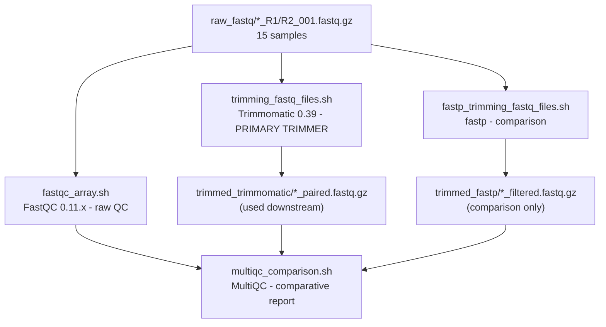
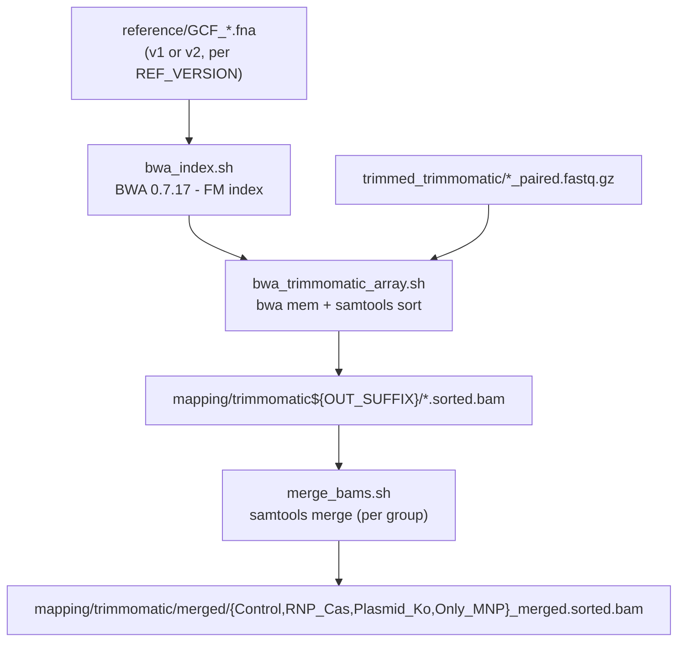
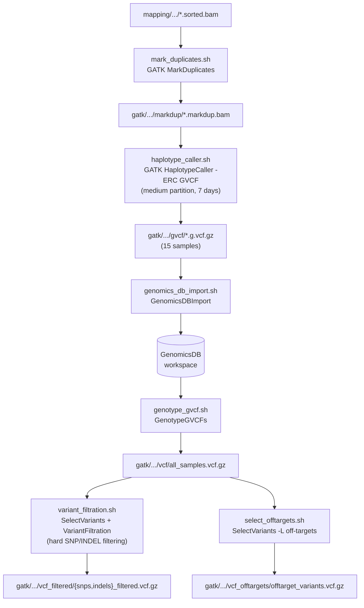
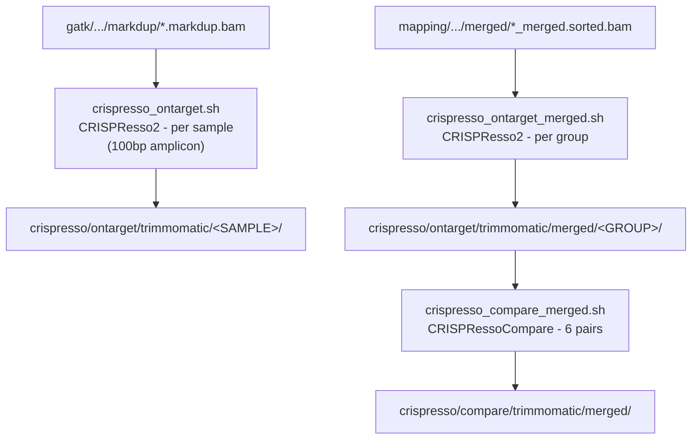
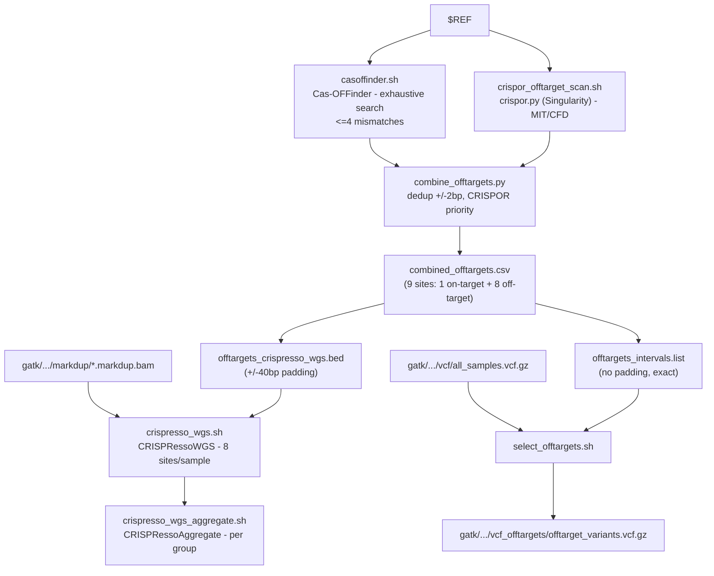
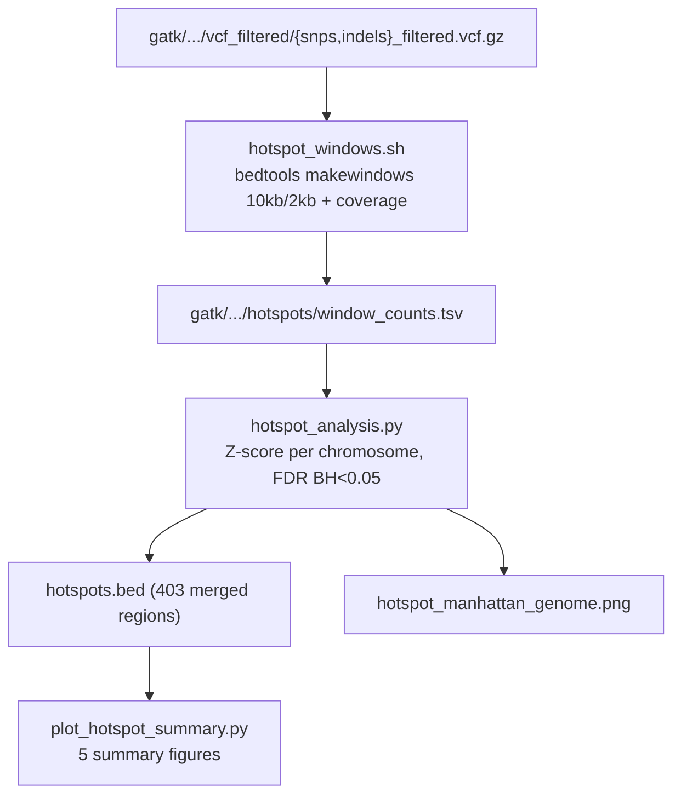
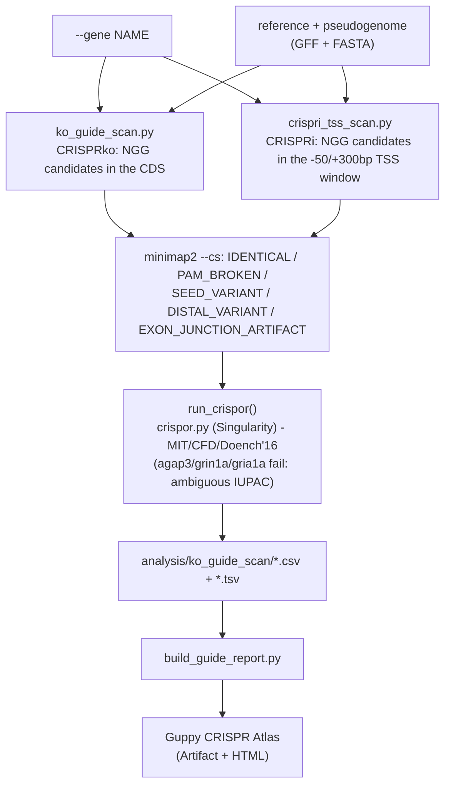
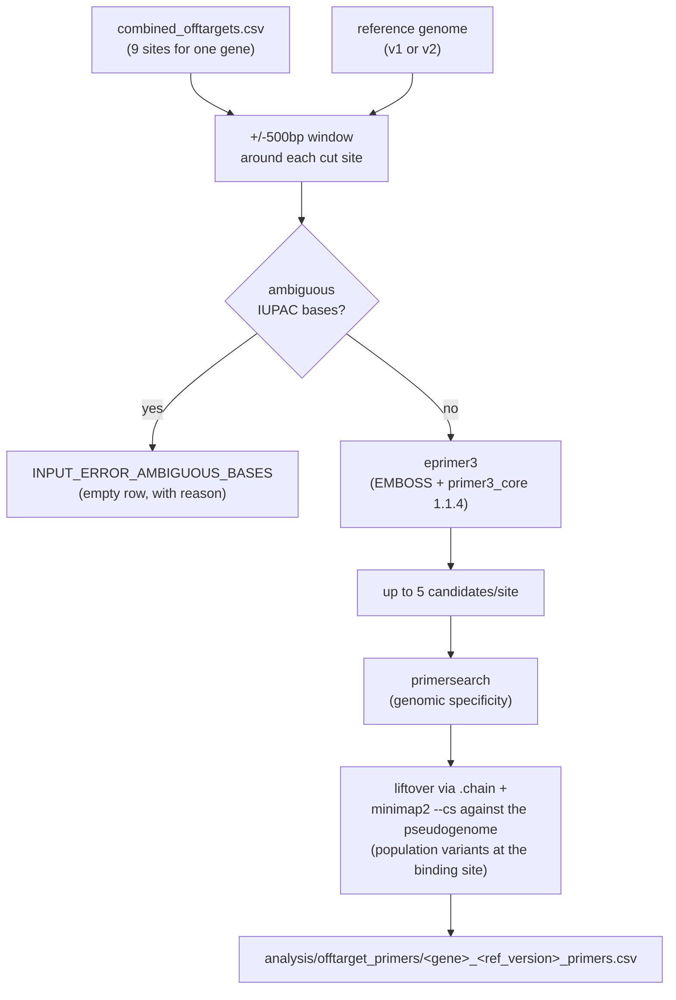

# Detailed Pipeline

Technical reference document: what each stage does, with exact parameters, and which script runs
it. For "how do I run this with my own gene/guide/reference version" see
[TUTORIAL.md](TUTORIAL.md). For "where are the results that were already generated" see
[RESULTS.md](RESULTS.md).

All scripts marked **dual-genome (v1/v2)** do `source codes/genome_versions.sh` and accept
`REF_VERSION=v1|v2` (default `v1`) — see [genome_versions.sh](../codes/genome_versions.sh).
Scripts marked **v1-only** haven't been migrated to v2 yet (some deliberately, e.g. group-level
scripts that depend on the v1 joint genotyping that's already finished).

## Table of Contents

1. [QC and Read Trimming](#1-qc-and-read-trimming)
2. [Mapping to the Reference Genome](#2-mapping-to-the-reference-genome)
3. [Variant Calling — GATK](#3-variant-calling--gatk)
4. [On-target Analysis — CRISPResso2](#4-on-target-analysis--crispresso2)
5. [Off-target Discovery and Analysis](#5-off-target-discovery-and-analysis)
6. [Variant Hotspots](#6-variant-hotspots)
7. [Colombian Population Genomes](#7-colombian-population-genomes)
8. [CRISPR Guide Design (KO / CRISPRi) per Gene](#8-crispr-guide-design-ko--crispri-per-gene)
9. [PCR Primer Design](#9-pcr-primer-design)

---

## 1. QC and Read Trimming

**Purpose:** remove sequencing adapters and low-quality bases before mapping, without discarding
so much signal that real depth is lost (NovaSeq X uses binned, not continuous, quality scores, so
thresholds are deliberately lenient).



| Script | SLURM resources | Purpose |
|---|---|---|
| `codes/filtering/trimming_fastq_files.sh` | array 1-15%8, 8cpu, 16G, 20h, short | **Primary trimmer**, used by the whole pipeline downstream |
| `codes/filtering/fastp_trimming_fastq_files.sh` | array 1-15%8, 8cpu, 16G, 20h, short | Alternate trimmer, only for comparison against Trimmomatic |
| `codes/filtering/fastqc_array.sh` | array 1-90%16, 2cpu, 4G, 10h, short | Per-file QC (90 = 15 samples × 2 reads × 3 sets) |
| `codes/filtering/multiqc_comparison.sh` | 4cpu, 8G, 20h, short | Aggregates all FastQC reports/logs into one interactive HTML |

**Trimmomatic (the trimmer used downstream):**
```bash
trimmomatic PE -threads 8 -phred33 \
  ${SAMPLE}_R1_001.fastq.gz ${SAMPLE}_R2_001.fastq.gz \
  ${SAMPLE}_R1_paired.fastq.gz ${SAMPLE}_R1_unpaired.fastq.gz \
  ${SAMPLE}_R2_paired.fastq.gz ${SAMPLE}_R2_unpaired.fastq.gz \
  ILLUMINACLIP:NexteraPE-PE.fa:2:30:10:8:keepBothReads \
  LEADING:2 TRAILING:2 SLIDINGWINDOW:4:12 MINLEN:50
```
`LEADING`/`TRAILING`/`SLIDINGWINDOW` are deliberately gentle (2 and 4:12, not Trimmomatic's more
aggressive defaults) so as not to over-trim NovaSeq X's binned quality scores. `unpaired` reads
are discarded throughout the downstream analysis.

**fastp (comparison, not used downstream):**
```bash
fastp -i ${SAMPLE}_R1_001.fastq.gz -I ${SAMPLE}_R2_001.fastq.gz \
  -o ${SAMPLE}_R1_filtered.fastq.gz -O ${SAMPLE}_R2_filtered.fastq.gz \
  --detect_adapter_for_pe --qualified_quality_phred 12 --length_required 50 --thread 8
```

---

## 2. Mapping to the Reference Genome

**Purpose:** align trimmed reads to the reference genome with BWA-MEM, producing sorted,
read-group-tagged (`@RG`) BAMs ready for GATK.



| Script | SLURM resources | Dual-genome | Purpose |
|---|---|---|---|
| `codes/mapping/bwa_index.sh` | 4cpu, 32G, 10h, short | ✅ v1/v2 | Builds the BWA FM-index over `$REF` |
| `codes/mapping/bwa_trimmomatic_array.sh` | array 1-15%8, 8cpu, 32G, 20h, short | ✅ v1/v2 | Aligns each sample, produces a sorted BAM + `flagstat` |
| `codes/CRISPResso/merge_bams.sh` | 8cpu, 32G, 4h, short | v1-only | Merges each experimental group's markdup BAMs into one BAM per group |

```bash
bwa mem -t 8 -R "@RG\tID:${SAMPLE}\tSM:${SAMPLE}\tPL:ILLUMINA\tLB:lib1\tPU:unit1" \
  "$REF" ${SAMPLE}_R1_paired.fastq.gz ${SAMPLE}_R2_paired.fastq.gz \
  | samtools sort -@ 8 -o ${SAMPLE}.sorted.bam
samtools index ${SAMPLE}.sorted.bam
samtools flagstat ${SAMPLE}.sorted.bam > ${SAMPLE}_flagstat.txt
```
Important note: `merge_bams.sh` merges the BAMs **after MarkDuplicates** (step 3), not the raw
`sorted.bam` files — the actual order is mapping → GATK MarkDuplicates → per-group merge.

---

## 3. Variant Calling — GATK

**Purpose:** identify SNPs/INDELs per sample and jointly genotype across all 15 samples, following
GATK4 best practices (no VQSR — there's no known-variant database for *P. reticulata*, so hard
threshold filtering is used instead).



| Script | SLURM resources | Dual-genome | Purpose |
|---|---|---|---|
| `mark_duplicates.sh` | array 1-15%8, 4cpu, 32G, 10h, short | ✅ | Flags (doesn't remove) PCR/optical duplicates per sample |
| `haplotype_caller.sh` | array 1-15%8, 4cpu, 32G, **7 days**, **medium** | ✅ | Per-sample diploid calling in GVCF mode — the project's historical bottleneck (the `short`/3-day partition used to truncate GVCFs) |
| `genomics_db_import.sh` | 8cpu, 64G, 20h, short | ✅ | Combines the 15 GVCFs into a joint GenomicsDB workspace |
| `genotype_gvcf.sh` | 8cpu, 64G, 20h, short | ✅ | Joint genotyping of all 15 samples → `all_samples.vcf.gz` |
| `variant_filtration.sh` | 4cpu, 32G, 20h, short | ✅ | Splits SNP/INDEL and applies hard filtering |
| `select_offtargets.sh` | 4cpu, 16G, 20h, short | ✅ | Extracts only the 8 predicted off-target loci from the joint VCF |

```bash
gatk MarkDuplicates -I ${SAMPLE}.sorted.bam -O ${SAMPLE}.markdup.bam \
  -M ${SAMPLE}_dup_metrics.txt --REMOVE_DUPLICATES false --VALIDATION_STRINGENCY SILENT

gatk HaplotypeCaller -R "$REF" -I ${SAMPLE}.markdup.bam -O ${SAMPLE}.g.vcf.gz \
  -L "$INTERVALS_FILE" -ERC GVCF --sample-name "$SAMPLE" \
  --native-pair-hmm-threads 4 -ploidy 2

gatk GenomicsDBImport -V s1.g.vcf.gz -V s2.g.vcf.gz ... (15 samples) \
  --genomicsdb-workspace-path genomicsdb/ -L "$INTERVALS_FILE" --reader-threads 8

gatk GenotypeGVCFs -R "$REF" -V gendb://genomicsdb/ -O all_samples.vcf.gz

# Hard filtering for SNPs:
gatk VariantFiltration -R "$REF" -V snps_raw.vcf.gz \
  --filter-expression "QD < 2.0"              --filter-name QD2 \
  --filter-expression "FS > 60.0"              --filter-name FS60 \
  --filter-expression "MQ < 40.0"              --filter-name MQ40 \
  --filter-expression "MQRankSum < -12.5"      --filter-name MQRankSum-12.5 \
  --filter-expression "ReadPosRankSum < -8.0"  --filter-name ReadPosRankSum-8 \
  -O snps_filtered.vcf.gz

# Hard filtering for INDELs:
gatk VariantFiltration -R "$REF" -V indels_raw.vcf.gz \
  --filter-expression "QD < 2.0"                --filter-name QD2 \
  --filter-expression "FS > 200.0"              --filter-name FS200 \
  --filter-expression "ReadPosRankSum < -20.0"  --filter-name ReadPosRankSum-20 \
  -O indels_filtered.vcf.gz
```

---

## 4. On-target Analysis — CRISPResso2

**Purpose:** quantify actual editing efficiency (% indels) at the bdnf cut site, per individual
sample and per experimental group, and compare groups against each other.



| Script | SLURM resources | Dual-genome | Purpose |
|---|---|---|---|
| `crispresso_ontarget.sh` | array 1-15%8, 4cpu, 32G, 6h, short | ✅ | Editing quantification per individual sample |
| `crispresso_ontarget_merged.sh` | array 1-4, 4cpu, 32G, 6h, short | ✅ | Editing quantification per group (merged BAM) — **authoritative track for between-group comparison** |
| `crispresso_compare_merged.sh` | 4cpu, 16G, 2h, short | v1-only | 6 pairwise comparisons across the 4 groups |

```bash
CRISPResso --bam_input sorted.bam \
  --amplicon_seq "$AMPLICON_FWD,$AMPLICON_RC" --amplicon_name "bdnf_fwd,bdnf_rc" \
  --guide_seq "TGAGAGACGCCCCGGGCATG" --bam_chr_loc "$REGION" \
  --min_frequency_alleles_around_cut_to_plot 0.05 \
  --expand_ambiguous_alignments --place_report_in_output_folder --write_cleaned_report
```
Region/amplicon v1: `NC_024333.1:15922000-15922100` (100bp); v2:
`NC_088832.1:15849655-15849755`. Both strands (`_fwd`/`_rc`) are used because the guide targets
the negative strand. `CRISPRessoCompare` replaced `CRISPRessoPooled` (bug documented in
`CLAUDE.md` — redundant with the merged-groups track).

---

## 5. Off-target Discovery and Analysis

**Purpose:** computationally predict every site in the genome where the guide could cut off-target
(up to 4 mismatches), and quantify actual editing at each one from the same, already-mapped WGS
reads.



| Script | SLURM resources | Dual-genome | Purpose |
|---|---|---|---|
| `casoffinder.sh` | 8cpu, 32G, 4h, short | ✅ | Exhaustive genomic search for `NNN...NGG` sites similar to the guide |
| `crispor_offtarget_scan.sh` | — (Singularity container) | ✅ | Real MIT/CFD scores via `crispor.py` against the whole genome |
| `combine_offtargets.py` | — (interactive) | ✅ | Merges and deduplicates both sources, generates BED/interval-list |
| `crispresso_wgs.sh` | array 1-15%8, 4cpu, 32G, 8h, short | ✅ | Quantifies indels at the 8 sites directly from the full WGS BAM |
| `crispresso_wgs_aggregate.sh` | 4cpu, 16G, 2h, short | v1-only | Aggregates WGS results per experimental group |

```bash
# Cas-OFFinder - input: genome, NGG PAM, ambiguous guide+PAM, 4 mismatches
cas-offinder casoffinder_input.txt C offtargets.txt
# input file:
#   $REF
#   NNNNNNNNNNNNNNNNNNNNNGG
#   TGAGAGACGCCCCGGGCATGNGG 4

# CRISPRessoWGS - 8 regions simultaneously from the full BAM
CRISPRessoWGS --bam_file markdup.bam --region_file offtargets_crispresso_wgs.bed \
  --reference_file "$REF" --min_reads_to_use_region 10 \
  --min_frequency_alleles_around_cut_to_plot 0.05 --expand_ambiguous_alignments --skip_failed
```

**Key parameters of `combine_offtargets.py`:** `TOLERANCE=2` (bp, to merge Cas-OFFinder/CRISPOR
duplicates), dedup priority `CRISPOR > CasOFFinder` (CRISPOR carries MIT/CFD + locus),
`WGS_PADDING=40` (BED window = 23bp protospacer + 2×40 = 103bp — must be smaller than the 150bp
read length so CRISPRessoWGS can resolve the region with a single read). `select_offtargets.sh`,
by contrast, uses the **exact** interval (`offtargets_intervals.list`, no padding) — i.e., GATK and
CRISPRessoWGS analyze different-sized windows around the same site (see the IUPAC-code finding in
`CLAUDE.md`, "Known Issues" section).

---

## 6. Variant Hotspots

**Purpose:** identify regions of the genome with abnormally high variant density between the
Colombian population and the reference, beyond the CRISPR sites — general population-genomics
context.



| Script | SLURM resources | Purpose |
|---|---|---|
| `hotspot_windows.sh` | 4cpu, 24G, 3h, short | Counts PASS SNPs/INDELs in 10kb sliding windows (2kb step) |
| `hotspot_analysis.sh`/`.py` | 1cpu, 16G, 1h, short | Computes per-chromosome Z-score, calls hotspots (FDR BH<0.05, fallback Z>4.0), merges adjacent windows (`bedtools merge -d 2000`) |
| `plot_hotspot_summary.py` | — | 5 final figures (variants per chromosome, hotspot ranking, zoom on the densest LG, etc.) |

```bash
bedtools makewindows -g genome.txt -w 10000 -s 2000 > windows_10kb_2kb.bed
bedtools coverage -counts -a windows_10kb_2kb.bed -b snps.bed > window_counts_snp.bed
# Z_THRESH = 4.0 (fallback if statsmodels is unavailable); primary threshold: FDR (Benjamini-Hochberg) < 0.05
```
Historical result (v1): 403 merged hotspot regions, 1,780 windows with FDR<0.05. **v1-only**
stage — hasn't been run under v2 yet (see [RESULTS.md](RESULTS.md)).

---

## 7. Colombian Population Genomes

**Purpose:** build a reference genome that represents the Colombian population (not the public
genome's Trinidad/Guanapo population), for accurate guide/primer classification and as a reusable
resource for any future analysis on this population. Two complementary methods — see the full
comparison in their own READMEs:
[reference/pseudogenome/README.md](../reference/pseudogenome/README.md) and
[reference/colombian_scaffolded_genome/README.md](../reference/colombian_scaffolded_genome/README.md).

```mermaid
flowchart TD
    subgraph Pseudogenome["Method A - Pseudogenome via bcftools consensus"]
    FVCF["vcf_filtered/{snps,indels}_filtered.vcf.gz"] --> MP["make_pseudogenome.sh\nbcftools consensus -H A\n(3 Control samples only, AF>=0.667)"]
    MP --> PG["colombian_pseudogenome.fna + .chain"]
    PG --> LO1["liftoff_pseudogenome.sh\nLiftoff v1.5.1"]
    LO1 --> GFF1["colombian_pseudogenome.liftoff.gff3\n(99.5% transfer)"]
    end
    subgraph DeNovo["Method B - De novo assembly via SPAdes and RagTag"]
    FQ["trimmed_trimmomatic/Control_*.fastq.gz\n(3 replicates)"] --> SP["spades_coassembly.sh\nSPAdes 4.0.0 --isolate\n(bigmem, 470G, 10 days)"]
    SP --> CT["contigs.fasta\n(3.4M contigs, N50 669bp)"]
    CT --> RT["ragtag_scaffold.sh\nRagTag 2.1.0 scaffold -C"]
    RT --> SC["ragtag.scaffold.fasta\n(N50 28.4Mb, 24 scaffolds)"]
    SC --> TGS["tgsgapcloser_genome.sh\n+ nextpolish_genome.sh\n(gap-filling + polishing, Nanopore+Illumina)"]
    TGS --> FINAL["colombian_gapfilled genome\n(BUSCO 95.5%)"]
    FINAL --> LO2["liftoff_annotation.sh"]
    LO2 --> GFF2["colombian_scaffolded.liftoff.gff3"]
    end
```



| Script | SLURM resources | Purpose |
|---|---|---|
| `codes/analysis/make_pseudogenome.sh` | 4cpu, 48G, 6h, short | Substitutes high-confidence variants from the 3 Controls onto the reference |
| `codes/assembly/liftoff_pseudogenome.sh` | 8cpu, 16G, 2h, short | Transfers the reference annotation to the pseudogenome |
| `codes/assembly/spades_coassembly.sh` | 16cpu, 470G, 10 days, bigmem | De novo co-assembly of the 3 Control replicates |
| `codes/assembly/ragtag_scaffold.sh` | 8cpu, 32G, 12h, short | Orders/orients the contigs against the reference |
| `codes/assembly/tgsgapcloser_genome.sh` | 16cpu, 64G, 24h, short | Fills gaps with Nanopore reads (~3.2x, [[nanopore_epigenome_data]]) |
| `codes/assembly/nextpolish_genome.sh` | 32cpu, 64G, 3 days, medium | Polishing with short Illumina reads |
| `codes/assembly/busco_qc*.sh` / `quast_qc*.sh` | 16cpu, 32G, 24-48h, short | Completeness QC (BUSCO, `actinopterygii_odb10`) and structural QC (QUAST) at every stage |

```bash
# Pseudogenome
CONTROLS="Control_MNP_I_S54_L002,Control_MNP_II_S55_L002,Control_MNP_III_S56_L002"
AF_THRESH=0.667
bcftools view -f PASS -s "$CONTROLS" snps_filtered.vcf.gz | bcftools view -g ^miss | \
  bcftools +fill-tags -- -t AF,AC,AN   # recomputes AF ONLY over the 3 controls
bcftools view -e "AF<${AF_THRESH}" ...  # only variants present in >=2/3 controls
bcftools consensus -f "$REF" -s Control_MNP_I_S54_L002 -H A -c colombian_pseudogenome.chain \
  ctrl_variants_hq.vcf.gz -o colombian_pseudogenome.fna

# De novo assembly
spades.py --pe1-1 ... --pe3-2 ... -t 16 -m 450 --isolate --checkpoints last -o spades_control_coassembly
ragtag.py scaffold "$REF" contigs.min500.fasta -o ragtag_output -t 8 -C
tgsgapcloser --scaff genome.fa --reads nanopore.fasta.gz --tgstype ont --thread 16
```
Result: the pseudogenome is production-ready (mapping/variant calling/CRISPResso); the de novo
assembly is draft quality (BUSCO 95.5% after gap-filling+polishing, but with more misassemblies
than the pseudogenome) — they're complementary, not interchangeable (see the comparison table in
the READMEs linked above).

---

## 8. CRISPR Guide Design (KO / CRISPRi) per Gene

**Purpose:** for any gene of interest, find candidate SpCas9 (NGG) guides and classify whether a
Colombian population variant invalidates or weakens them — before synthesizing anything in the
lab. Two modes: **CRISPRko** (cutting in the CDS, to knock out the gene) and **CRISPRi** (blocking
near the TSS, to silence without cutting).



| Script | Purpose |
|---|---|
| `codes/analysis/ko_guide_scan.py` | CRISPRko candidates: `--gene`, `--population {pseudogenome,scaffolded,pseudogenome_v2}` (default `pseudogenome`), `--no-crispor` |
| `codes/analysis/crispri_tss_scan.py` | CRISPRi candidates, same interface; fixed window `WINDOW_UPSTREAM=50` / `WINDOW_DOWNSTREAM=300` bp around the TSS |
| `codes/analysis/run_ko_guide_scan.sh` | Batch wrapper — edit the `GENES=(...)` array to run several genes in a row |
| `codes/analysis/build_guide_report.py` | Consolidates CRISPOR + variant classification for the 8 genes into `report_data.json` → Atlas |

Classification over a 23bp window (20bp spacer + PAM): **PAM** = last 3bp, **SEED** = 10bp
proximal to the PAM (most critical), **DISTAL** = the spacer's remaining 10bp. Candidates that
cross an exon-exon junction in the spliced CDS are marked `EXON_JUNCTION_ARTIFACT` (not real
contiguous genomic DNA — see the finding in `CLAUDE.md`).

How to run this for a new gene — see the step-by-step tutorial in
**[TUTORIAL.md](TUTORIAL.md#guide-design-for-a-new-gene)**.

**Known limitation:** 3 of the 8 genes (agap3, grin1a, gria1a) have no CRISPOR scores — the v1
reference (2014, short-read) has IUPAC ambiguity codes (K/M/R/S/W/Y, unresolved heterozygous
sites) that crash `crispor.py`'s own code along two different paths (`revComp()` with a `KeyError`
for agap3/grin1a; the Azimuth-2.0 model with a `ValueError` for gria1a). The manual scan and
variant classification are unaffected — only the additional specificity/efficiency ranking is
missing for those 3 genes. The analysis is planned to be repeated for these 3 genes against the
v2 genome (male, PacBio+Hi-C) once available — being a much better-resolved assembly, it likely
no longer carries these ambiguity codes.

---

## 9. PCR Primer Design

**Purpose:** design PCR primer pairs around each already-reported on-/off-target site, for gel
verification or targeted sequencing at much greater depth than WGS — validating in the lab what
this pipeline already predicted computationally.



| Script | SLURM resources | Purpose |
|---|---|---|
| `codes/analysis/setup_primer3.sh` | — (one-time, login node) | Installs `primer3_core` v1.1.4 (the legacy boulder-IO protocol `eprimer3` needs, not shipped with the EMBOSS module) |
| `codes/analysis/design_offtarget_primers.py` | — | Full logic: window extraction, `eprimer3`, `primersearch`, population check |
| `codes/analysis/run_offtarget_primer_design.sh` | 4cpu, 16G, 2h, short | SLURM wrapper — `GENE`/`SITES_CSV`/`REF_VERSION` |

```bash
eprimer3 -sequence window.fa -task 1 -numreturn 5 \
  -excludedregion "${excl_start},${excl_end}" \
  -optsize 20 -minsize 18 -maxsize 25 \
  -opttm 60 -mintm 58 -maxtm 62 -maxdifftm 3 \
  -ogcpercent 50 -mingc 40 -maxgc 60 \
  -psizeopt 300 -prange "200-400" -auto

primersearch -seqall "$REF" -infile pairs.txt -mismatchpercent 10 -outfile all.primersearch -auto
```
Default parameters (all adjustable via CLI): ±500bp design window, ±75bp excluded region around
the cut, 200-400bp product, 58-62°C Tm (optimum 60), 40-60% GC, up to 5 candidates per site, 10%
mismatch tolerance for specificity. Population validation uses the `.chain` file (exact liftover,
not a fixed coordinate buffer — see the coordinate-drift finding in `CLAUDE.md`) to locate the
equivalent window in the pseudogenome before searching for variants with `minimap2 --cs`.

**Known limitation:** the same 2 bdnf off-target sites blocked by ambiguous IUPAC codes in primer
design (`off_target_1`, `off_target_7` in v1) — confirmed this does **not** affect the already-
reported GATK/CRISPResso2 results (their actual analysis windows, much narrower than the primer
design window, are clean). See detail in `CLAUDE.md`.

**Verification of external primers (RT-qPCR):** in addition to the automated design above, this
project has also been used to verify existing lab RT-qPCR primers (not generated by this
pipeline) against the Colombian pseudogenome — locating the exact binding site (including primers
that cross an exon-exon junction, via spliced-mRNA reconstruction from the annotation) and
comparing against the reference using the same `.chain`-based liftover. This is an ad-hoc query,
not a parameterized script yet. Real result (2026-09-08): a confirmed Colombian SNP in an
`rpl13a` primer — see the "RT-qPCR" section of
[`analysis/reports/primer_design_report.html`](../analysis/reports/primer_design_report.html) and
`CLAUDE.md` ("RT-qPCR Primer Verification") for full detail.
