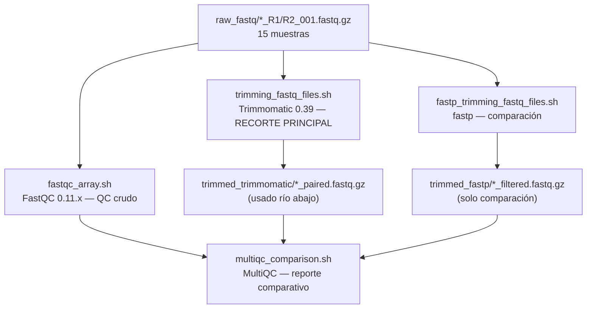
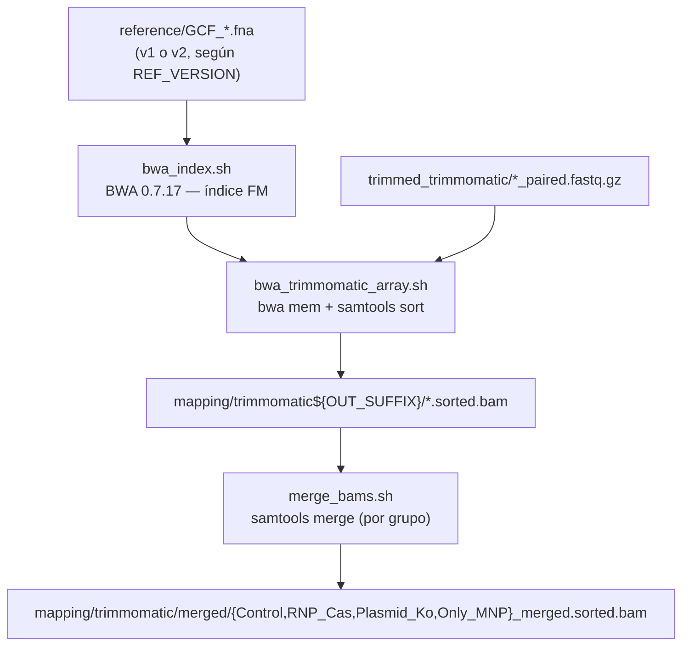
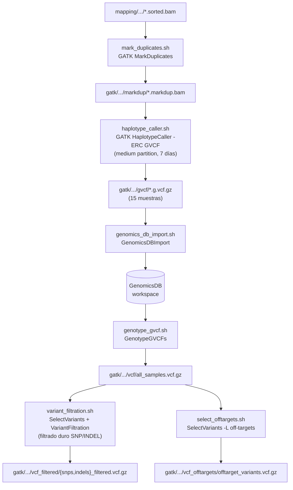
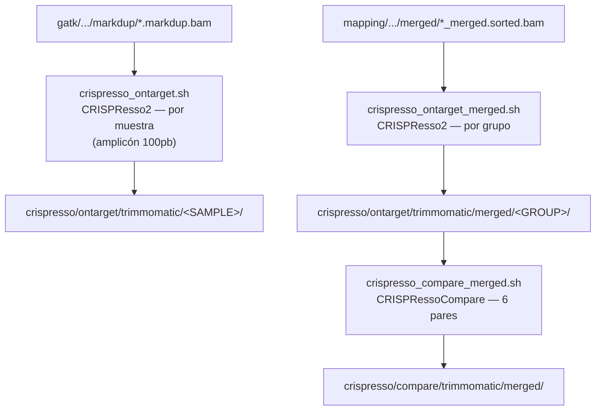
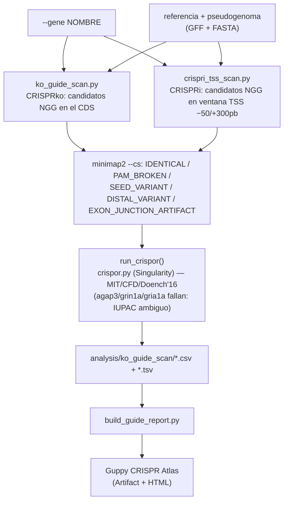
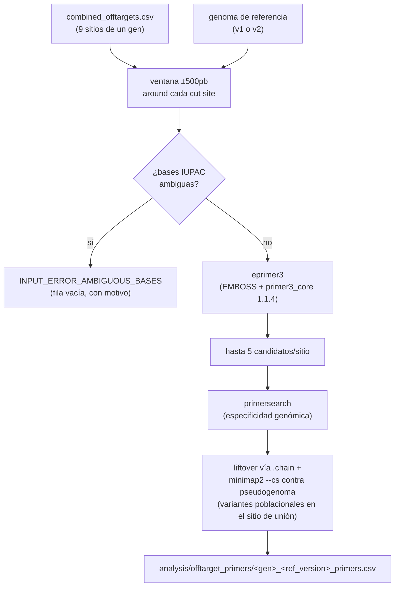

# Pipeline detallado

Documento de referencia técnica: qué hace cada etapa, con qué parámetros exactos, y qué script
la ejecuta. Para "cómo correr esto con mi propio gen/gen guía/versión de referencia" ver
[TUTORIAL.md](TUTORIAL.md). Para "dónde están los resultados ya generados" ver
[RESULTS.md](RESULTS.md).

Todos los scripts marcados **dual-genoma (v1/v2)** hacen `source codes/genome_versions.sh` y
aceptan `REF_VERSION=v1|v2` (por defecto `v1`) — ver [genome_versions.sh](../codes/genome_versions.sh).
Los marcados **v1-only** todavía no se han migrado a v2 (algunos porque no tiene sentido migrarlos,
como los scripts group-level que dependen del genotipado conjunto v1 ya terminado).

## Índice

1. [QC y recorte de lecturas](#1-qc-y-recorte-de-lecturas)
2. [Mapeo al genoma de referencia](#2-mapeo-al-genoma-de-referencia)
3. [Llamado de variantes — GATK](#3-llamado-de-variantes--gatk)
4. [Análisis on-target — CRISPResso2](#4-análisis-on-target--crispresso2)
5. [Descubrimiento y análisis de off-targets](#5-descubrimiento-y-análisis-de-off-targets)
6. [Hotspots de variantes](#6-hotspots-de-variantes)
7. [Genomas poblacionales colombianos](#7-genomas-poblacionales-colombianos)
8. [Diseño de guías CRISPR (KO / CRISPRi) por gen](#8-diseño-de-guías-crispr-ko--crispri-por-gen)
9. [Diseño de primers PCR](#9-diseño-de-primers-pcr)

---

## 1. QC y recorte de lecturas

**Objetivo:** eliminar adaptadores de secuenciación y bases de baja calidad antes de mapear, sin
descartar tanta señal que se pierda profundidad real (NovaSeq X usa scores de calidad binned,
no continuos, así que los umbrales son deliberadamente permisivos).



| Script | Recursos SLURM | Propósito |
|---|---|---|
| `codes/filtering/trimming_fastq_files.sh` | array 1-15%8, 8cpu, 16G, 20h, short | **Recortador principal**, usado por todo el pipeline río abajo |
| `codes/filtering/fastp_trimming_fastq_files.sh` | array 1-15%8, 8cpu, 16G, 20h, short | Recortador alterno, solo para comparar contra Trimmomatic |
| `codes/filtering/fastqc_array.sh` | array 1-90%16, 2cpu, 4G, 10h, short | QC por archivo (90 = 15 muestras × 2 lecturas × 3 conjuntos) |
| `codes/filtering/multiqc_comparison.sh` | 4cpu, 8G, 20h, short | Agrega todos los reportes FastQC/logs en un HTML interactivo |

**Trimmomatic (el recortador usado río abajo):**
```bash
trimmomatic PE -threads 8 -phred33 \
  ${SAMPLE}_R1_001.fastq.gz ${SAMPLE}_R2_001.fastq.gz \
  ${SAMPLE}_R1_paired.fastq.gz ${SAMPLE}_R1_unpaired.fastq.gz \
  ${SAMPLE}_R2_paired.fastq.gz ${SAMPLE}_R2_unpaired.fastq.gz \
  ILLUMINACLIP:NexteraPE-PE.fa:2:30:10:8:keepBothReads \
  LEADING:2 TRAILING:2 SLIDINGWINDOW:4:12 MINLEN:50
```
`LEADING`/`TRAILING`/`SLIDINGWINDOW` deliberadamente suaves (2 y 4:12, no los valores por defecto
más agresivos de Trimmomatic) para no sobre-recortar los scores binned de NovaSeq X. Lecturas
`unpaired` se descartan en todo el análisis río abajo.

**fastp (comparación, no usado río abajo):**
```bash
fastp -i ${SAMPLE}_R1_001.fastq.gz -I ${SAMPLE}_R2_001.fastq.gz \
  -o ${SAMPLE}_R1_filtered.fastq.gz -O ${SAMPLE}_R2_filtered.fastq.gz \
  --detect_adapter_for_pe --qualified_quality_phred 12 --length_required 50 --thread 8
```

---

## 2. Mapeo al genoma de referencia

**Objetivo:** alinear las lecturas recortadas al genoma de referencia con BWA-MEM, produciendo
BAMs ordenados y con grupo de lectura (`@RG`) listos para GATK.



| Script | Recursos SLURM | Dual-genoma | Propósito |
|---|---|---|---|
| `codes/mapping/bwa_index.sh` | 4cpu, 32G, 10h, short | ✅ v1/v2 | Construye el índice FM-index de BWA sobre `$REF` |
| `codes/mapping/bwa_trimmomatic_array.sh` | array 1-15%8, 8cpu, 32G, 20h, short | ✅ v1/v2 | Alinea cada muestra, produce BAM ordenado + `flagstat` |
| `codes/CRISPResso/merge_bams.sh` | 8cpu, 32G, 4h, short | v1-only | Fusiona los BAMs markdup de cada grupo experimental en un BAM por grupo |

```bash
bwa mem -t 8 -R "@RG\tID:${SAMPLE}\tSM:${SAMPLE}\tPL:ILLUMINA\tLB:lib1\tPU:unit1" \
  "$REF" ${SAMPLE}_R1_paired.fastq.gz ${SAMPLE}_R2_paired.fastq.gz \
  | samtools sort -@ 8 -o ${SAMPLE}.sorted.bam
samtools index ${SAMPLE}.sorted.bam
samtools flagstat ${SAMPLE}.sorted.bam > ${SAMPLE}_flagstat.txt
```
Nota importante: `merge_bams.sh` fusiona los BAMs **posteriores a MarkDuplicates** (paso 3), no
los BAMs crudos de `sorted.bam` — el orden real es mapeo → GATK MarkDuplicates → fusión por grupo.

---

## 3. Llamado de variantes — GATK

**Objetivo:** identificar SNPs/INDELs por muestra y genotiparlos conjuntamente entre las 15
muestras, siguiendo las buenas prácticas de GATK4 (sin VQSR — no existe una base de variantes
conocidos para *P. reticulata*, así que se usa filtrado duro por umbrales).



| Script | Recursos SLURM | Dual-genoma | Propósito |
|---|---|---|---|
| `mark_duplicates.sh` | array 1-15%8, 4cpu, 32G, 10h, short | ✅ | Marca (no elimina) duplicados PCR/ópticos por muestra |
| `haplotype_caller.sh` | array 1-15%8, 4cpu, 32G, **7 días**, **medium** | ✅ | Llamado diploide por muestra en modo GVCF — el cuello de botella histórico del proyecto (partición `short`/3 días truncaba GVCFs) |
| `genomics_db_import.sh` | 8cpu, 64G, 20h, short | ✅ | Combina los 15 GVCFs en un workspace GenomicsDB conjunto |
| `genotype_gvcf.sh` | 8cpu, 64G, 20h, short | ✅ | Genotipado conjunto de las 15 muestras → `all_samples.vcf.gz` |
| `variant_filtration.sh` | 4cpu, 32G, 20h, short | ✅ | Separa SNP/INDEL y aplica filtrado duro |
| `select_offtargets.sh` | 4cpu, 16G, 20h, short | ✅ | Extrae del VCF conjunto solo los 8 loci off-target predichos |

```bash
gatk MarkDuplicates -I ${SAMPLE}.sorted.bam -O ${SAMPLE}.markdup.bam \
  -M ${SAMPLE}_dup_metrics.txt --REMOVE_DUPLICATES false --VALIDATION_STRINGENCY SILENT

gatk HaplotypeCaller -R "$REF" -I ${SAMPLE}.markdup.bam -O ${SAMPLE}.g.vcf.gz \
  -L "$INTERVALS_FILE" -ERC GVCF --sample-name "$SAMPLE" \
  --native-pair-hmm-threads 4 -ploidy 2

gatk GenomicsDBImport -V s1.g.vcf.gz -V s2.g.vcf.gz ... (15 muestras) \
  --genomicsdb-workspace-path genomicsdb/ -L "$INTERVALS_FILE" --reader-threads 8

gatk GenotypeGVCFs -R "$REF" -V gendb://genomicsdb/ -O all_samples.vcf.gz

# Filtrado duro SNP:
gatk VariantFiltration -R "$REF" -V snps_raw.vcf.gz \
  --filter-expression "QD < 2.0"              --filter-name QD2 \
  --filter-expression "FS > 60.0"              --filter-name FS60 \
  --filter-expression "MQ < 40.0"              --filter-name MQ40 \
  --filter-expression "MQRankSum < -12.5"      --filter-name MQRankSum-12.5 \
  --filter-expression "ReadPosRankSum < -8.0"  --filter-name ReadPosRankSum-8 \
  -O snps_filtered.vcf.gz

# Filtrado duro INDEL:
gatk VariantFiltration -R "$REF" -V indels_raw.vcf.gz \
  --filter-expression "QD < 2.0"                --filter-name QD2 \
  --filter-expression "FS > 200.0"              --filter-name FS200 \
  --filter-expression "ReadPosRankSum < -20.0"  --filter-name ReadPosRankSum-20 \
  -O indels_filtered.vcf.gz
```

---

## 4. Análisis on-target — CRISPResso2

**Objetivo:** cuantificar la eficiencia real de edición (% de indeles) en el sitio del cut site
de bdnf, por muestra individual y por grupo experimental, y comparar grupos entre sí.



| Script | Recursos SLURM | Dual-genoma | Propósito |
|---|---|---|---|
| `crispresso_ontarget.sh` | array 1-15%8, 4cpu, 32G, 6h, short | ✅ | Cuantificación de edición por muestra individual |
| `crispresso_ontarget_merged.sh` | array 1-4, 4cpu, 32G, 6h, short | ✅ | Cuantificación de edición por grupo (BAM fusionado) — **track autoritativo para comparación entre grupos** |
| `crispresso_compare_merged.sh` | 4cpu, 16G, 2h, short | v1-only | 6 comparaciones pareadas entre los 4 grupos |

```bash
CRISPResso --bam_input sorted.bam \
  --amplicon_seq "$AMPLICON_FWD,$AMPLICON_RC" --amplicon_name "bdnf_fwd,bdnf_rc" \
  --guide_seq "TGAGAGACGCCCCGGGCATG" --bam_chr_loc "$REGION" \
  --min_frequency_alleles_around_cut_to_plot 0.05 \
  --expand_ambiguous_alignments --place_report_in_output_folder --write_cleaned_report
```
Región/amplicón v1: `NC_024333.1:15922000-15922100` (100pb); v2:
`NC_088832.1:15849655-15849755`. Se usan ambas hebras (`_fwd`/`_rc`) porque la guía apunta a la
hebra negativa. `CRISPRessoCompare` reemplazó a `CRISPRessoPooled` (bug documentado en
`CLAUDE.md` — comparación redundante con el track de grupos fusionados).

---

## 5. Descubrimiento y análisis de off-targets

**Objetivo:** predecir computacionalmente todos los sitios del genoma donde la guía podría
cortar fuera de blanco (hasta 4 mismatches), y cuantificar la edición real en cada uno desde las
mismas lecturas WGS ya mapeadas.


| Script | Recursos SLURM | Dual-genoma | Propósito |
|---|---|---|---|
| `casoffinder.sh` | 8cpu, 32G, 4h, short | ✅ | Búsqueda genómica exhaustiva de sitios `NNN...NGG` similares a la guía |
| `crispor_offtarget_scan.sh` | — (contenedor Singularity) | ✅ | Puntajes MIT/CFD reales vía `crispor.py` sobre el genoma completo |
| `combine_offtargets.py` | — (interactivo) | ✅ | Fusiona y deduplica ambas fuentes, genera BED/interval-list |
| `crispresso_wgs.sh` | array 1-15%8, 4cpu, 32G, 8h, short | ✅ | Cuantifica indeles en los 8 sitios directamente desde el BAM WGS completo |
| `crispresso_wgs_aggregate.sh` | 4cpu, 16G, 2h, short | v1-only | Agrega resultados WGS por grupo experimental |

```bash
# Cas-OFFinder — input: genoma, PAM NGG, guía+PAM ambiguo, 4 mismatches
cas-offinder casoffinder_input.txt C offtargets.txt
# archivo de input:
#   $REF
#   NNNNNNNNNNNNNNNNNNNNNGG
#   TGAGAGACGCCCCGGGCATGNGG 4

# CRISPRessoWGS — 8 regiones simultáneas desde el BAM completo
CRISPRessoWGS --bam_file markdup.bam --region_file offtargets_crispresso_wgs.bed \
  --reference_file "$REF" --min_reads_to_use_region 10 \
  --min_frequency_alleles_around_cut_to_plot 0.05 --expand_ambiguous_alignments --skip_failed
```

**Parámetros clave de `combine_offtargets.py`:** `TOLERANCE=2` (pb, para fusionar duplicados
Cas-OFFinder/CRISPOR), prioridad de deduplicación `CRISPOR > CasOFFinder` (CRISPOR trae
MIT/CFD + locus), `WGS_PADDING=40` (ventana BED = 23pb protospacer + 2×40 = 103pb — debe ser
menor a la longitud de lectura de 150pb para que CRISPRessoWGS resuelva la región con una sola
lectura). `select_offtargets.sh`, en cambio, usa el intervalo **exacto** (`offtargets_intervals.list`,
sin padding) — es decir, GATK y CRISPRessoWGS analizan ventanas de distinto tamaño alrededor del
mismo sitio (ver hallazgo sobre códigos IUPAC en `CLAUDE.md`, sección "Known Issues").

---

## 6. Hotspots de variantes

**Objetivo:** identificar regiones del genoma con densidad de variantes anormalmente alta entre
la población colombiana y la referencia, más allá de los sitios CRISPR — contexto poblacional
general.


| Script | Recursos SLURM | Propósito |
|---|---|---|
| `hotspot_windows.sh` | 4cpu, 24G, 3h, short | Cuenta SNPs/INDELs PASS en ventanas deslizantes de 10kb (paso 2kb) |
| `hotspot_analysis.sh`/`.py` | 1cpu, 16G, 1h, short | Calcula Z-score por cromosoma, llama hotspots (FDR BH<0.05, fallback Z>4.0), fusiona ventanas adyacentes (`bedtools merge -d 2000`) |
| `plot_hotspot_summary.py` | — | 5 figuras finales (variantes por cromosoma, ranking de hotspots, zoom al LG más denso, etc.) |

```bash
bedtools makewindows -g genome.txt -w 10000 -s 2000 > windows_10kb_2kb.bed
bedtools coverage -counts -a windows_10kb_2kb.bed -b snps.bed > window_counts_snp.bed
# Z_THRESH = 4.0 (fallback si no hay statsmodels); umbral principal: FDR (Benjamini-Hochberg) < 0.05
```
Resultado histórico (v1): 403 regiones hotspot fusionadas, 1,780 ventanas con FDR<0.05. Etapa
**solo v1** — no se ha corrido bajo v2 todavía (ver [RESULTS.md](RESULTS.md)).

---

## 7. Genomas poblacionales colombianos

**Objetivo:** construir un genoma de referencia que represente a la población colombiana (no la
población de Trinidad/Guanapo del genoma público), para clasificar guías/primers con precisión
y como recurso reutilizable para cualquier análisis futuro sobre esta población. Dos métodos
complementarios — ver comparación completa en sus propios README:
[reference/pseudogenome/README.md](../reference/pseudogenome/README.md) y
[reference/colombian_scaffolded_genome/README.md](../reference/colombian_scaffolded_genome/README.md).

```mermaid
flowchart TD
    subgraph Pseudogenoma["Metodo A — Pseudogenoma via bcftools consensus"]
    FVCF["vcf_filtered/{snps,indels}_filtered.vcf.gz"] --> MP["make_pseudogenome.sh\nbcftools consensus -H A\n(solo 3 muestras Control, AF≥0.667)"]
    MP --> PG["colombian_pseudogenome.fna + .chain"]
    PG --> LO1["liftoff_pseudogenome.sh\nLiftoff v1.5.1"]
    LO1 --> GFF1["colombian_pseudogenome.liftoff.gff3\n(99.5% transferencia)"]
    end
    subgraph DeNovo["Metodo B — Ensamblaje de novo via SPAdes y RagTag"]
    FQ["trimmed_trimmomatic/Control_*.fastq.gz\n(3 réplicas)"] --> SP["spades_coassembly.sh\nSPAdes 4.0.0 --isolate\n(bigmem, 470G, 10 días)"]
    SP --> CT["contigs.fasta\n(3.4M contigs, N50 669pb)"]
    CT --> RT["ragtag_scaffold.sh\nRagTag 2.1.0 scaffold -C"]
    RT --> SC["ragtag.scaffold.fasta\n(N50 28.4Mb, 24 scaffolds)"]
    SC --> TGS["tgsgapcloser_genome.sh\n+ nextpolish_genome.sh\n(gap-filling + pulido, Nanopore+Illumina)"]
    TGS --> FINAL["colombian_gapfilled genome\n(BUSCO 95.5%)"]
    FINAL --> LO2["liftoff_annotation.sh"]
    LO2 --> GFF2["colombian_scaffolded.liftoff.gff3"]
    end
```



| Script | Recursos SLURM | Propósito |
|---|---|---|
| `codes/analysis/make_pseudogenome.sh` | 4cpu, 48G, 6h, short | Sustituye variantes de alta confianza de los 3 Control sobre la referencia |
| `codes/assembly/liftoff_pseudogenome.sh` | 8cpu, 16G, 2h, short | Transfiere la anotación de la referencia al pseudogenoma |
| `codes/assembly/spades_coassembly.sh` | 16cpu, 470G, 10 días, bigmem | Co-ensamblaje de novo de las 3 réplicas Control |
| `codes/assembly/ragtag_scaffold.sh` | 8cpu, 32G, 12h, short | Ordena/orienta los contigs contra la referencia |
| `codes/assembly/tgsgapcloser_genome.sh` | 16cpu, 64G, 24h, short | Rellena gaps con lecturas Nanopore (~3.2x, [[nanopore_epigenome_data]]) |
| `codes/assembly/nextpolish_genome.sh` | 32cpu, 64G, 3 días, medium | Pulido con lecturas Illumina cortas |
| `codes/assembly/busco_qc*.sh` / `quast_qc*.sh` | 16cpu, 32G, 24-48h, short | QC de completitud (BUSCO, `actinopterygii_odb10`) y estructura (QUAST) en cada etapa |

```bash
# Pseudogenoma
CONTROLS="Control_MNP_I_S54_L002,Control_MNP_II_S55_L002,Control_MNP_III_S56_L002"
AF_THRESH=0.667
bcftools view -f PASS -s "$CONTROLS" snps_filtered.vcf.gz | bcftools view -g ^miss | \
  bcftools +fill-tags -- -t AF,AC,AN   # recalcula AF SOLO sobre los 3 controles
bcftools view -e "AF<${AF_THRESH}" ...  # solo variantes en ≥2/3 controles
bcftools consensus -f "$REF" -s Control_MNP_I_S54_L002 -H A -c colombian_pseudogenome.chain \
  ctrl_variants_hq.vcf.gz -o colombian_pseudogenome.fna

# Ensamblaje de novo
spades.py --pe1-1 ... --pe3-2 ... -t 16 -m 450 --isolate --checkpoints last -o spades_control_coassembly
ragtag.py scaffold "$REF" contigs.min500.fasta -o ragtag_output -t 8 -C
tgsgapcloser --scaff genome.fa --reads nanopore.fasta.gz --tgstype ont --thread 16
```
Resultado: pseudogenoma listo para producción (mapeo/variant calling/CRISPResso);
ensamblaje de novo calidad borrador (BUSCO 95.5% tras gap-filling+pulido, pero con más
misassemblies que el pseudogenoma) — son complementarios, no intercambiables (ver tabla
comparativa en los README enlazados arriba).

---

## 8. Diseño de guías CRISPR (KO / CRISPRi) por gen

**Objetivo:** para cualquier gen de interés, encontrar candidatos de guía SpCas9 (NGG) y
clasificar si una variante poblacional colombiana los invalida o debilita — antes de sintetizar
nada en el laboratorio. Dos modalidades: **CRISPRko** (corte en el CDS, para inactivar el gen) y
**CRISPRi** (bloqueo cerca del TSS, para silenciar sin cortar).



| Script | Propósito |
|---|---|
| `codes/analysis/ko_guide_scan.py` | Candidatos CRISPRko: `--gene`, `--population {pseudogenome,scaffolded,pseudogenome_v2}` (default `pseudogenome`), `--no-crispor` |
| `codes/analysis/crispri_tss_scan.py` | Candidatos CRISPRi, misma interfaz; ventana fija `WINDOW_UPSTREAM=50` / `WINDOW_DOWNSTREAM=300` pb alrededor del TSS |
| `codes/analysis/run_ko_guide_scan.sh` | Wrapper batch — editar el arreglo `GENES=(...)` para correr varios genes seguidos |
| `codes/analysis/build_guide_report.py` | Consolida CRISPOR + clasificación de variantes de los 8 genes en `report_data.json` → Atlas |

Clasificación por ventana de 23pb (20pb espaciador + PAM): **PAM** = últimas 3pb, **SEED** = 10pb
proximales al PAM (más crítico), **DISTAL** = 10pb restantes del espaciador. Candidatos que
cruzan una unión exón-exón en el CDS empalmado se marcan `EXON_JUNCTION_ARTIFACT` (no son ADN
genómico contiguo real, ver hallazgo en `CLAUDE.md`).

Cómo correr esto para un gen nuevo — ver el tutorial paso a paso en
**[TUTORIAL.md](TUTORIAL.md#diseño-de-guías-para-un-gen-nuevo)**.

**Limitación conocida:** 3 de los 8 genes (agap3, grin1a, gria1a) no tienen puntajes de CRISPOR
— la referencia v1 (2014, short-read) tiene códigos de ambigüedad IUPAC (K/M/R/S/W/Y, sitios
heterocigotos sin resolver) que hacen crashear el propio código de `crispor.py` en dos rutas
distintas (`revComp()` con `KeyError` para agap3/grin1a; el modelo Azimuth-2.0 con `ValueError`
para gria1a). El escaneo manual y la clasificación de variantes no se ven afectados — solo falta
el ranking adicional de especificidad/eficiencia para esos 3 genes. Se planea repetir el análisis
para estos 3 genes contra el genoma v2 (macho, PacBio+Hi-C) una vez esté disponible — al ser un
ensamblaje mucho mejor resuelto, es probable que ya no tenga estos códigos de ambigüedad.

---

## 9. Diseño de primers PCR

**Objetivo:** diseñar pares de primers PCR alrededor de cada sitio on-/off-target ya reportado,
para verificación en gel o secuenciación dirigida de mucha mayor profundidad que WGS —
validando en el laboratorio lo que este pipeline ya predijo computacionalmente.



| Script | Recursos SLURM | Propósito |
|---|---|---|
| `codes/analysis/setup_primer3.sh` | — (una sola vez, login node) | Instala `primer3_core` v1.1.4 (protocolo boulder-IO legado que necesita `eprimer3`, no viene con el módulo EMBOSS) |
| `codes/analysis/design_offtarget_primers.py` | — | Lógica completa: extracción de ventana, `eprimer3`, `primersearch`, chequeo poblacional |
| `codes/analysis/run_offtarget_primer_design.sh` | 4cpu, 16G, 2h, short | Wrapper SLURM — `GENE`/`SITES_CSV`/`REF_VERSION` |

```bash
eprimer3 -sequence window.fa -task 1 -numreturn 5 \
  -excludedregion "${excl_start},${excl_end}" \
  -optsize 20 -minsize 18 -maxsize 25 \
  -opttm 60 -mintm 58 -maxtm 62 -maxdifftm 3 \
  -ogcpercent 50 -mingc 40 -maxgc 60 \
  -psizeopt 300 -prange "200-400" -auto

primersearch -seqall "$REF" -infile pairs.txt -mismatchpercent 10 -outfile all.primersearch -auto
```
Parámetros por defecto (todos ajustables por CLI): ventana de diseño ±500pb, región excluida
±75pb alrededor del corte, producto 200-400pb, Tm 58-62°C (óptimo 60), GC 40-60%, hasta 5
candidatos por sitio, especificidad con 10% de mismatch tolerado. La validación poblacional usa
el archivo `.chain` (liftover exacto, no un buffer de coordenadas fijo — ver
`CLAUDE.md`/hallazgo de corrimiento de coordenadas) para localizar la ventana equivalente en el
pseudogenoma antes de buscar variantes con `minimap2 --cs`.

**Limitación conocida:** los mismos 2 sitios off-target de bdnf bloqueados por códigos IUPAC
ambiguos en el diseño de primers (`off_target_1`, `off_target_7` en v1) — confirmado que **no**
afecta los resultados ya reportados de GATK/CRISPResso2 (sus ventanas de análisis reales, mucho
más angostas que la ventana de diseño de primers, están limpias). Ver detalle en `CLAUDE.md`.

**Verificación de primers externos (RT-qPCR):** además del diseño automático de arriba, este
proyecto también se ha usado para verificar primers de RT-qPCR ya existentes en el laboratorio
(no generados por este pipeline) contra el pseudogenoma colombiano — localizando el sitio de
unión exacto (incluyendo primers que cruzan una unión exón-exón, vía reconstrucción del ARNm
empalmado desde la anotación) y comparando contra la referencia mediante el mismo liftover por
`.chain`. Es una consulta ad-hoc, no un script parametrizado todavía. Resultado real (2026-09-08):
un SNP colombiano confirmado en un primer de `rpl13a` — ver la sección "RT-qPCR" de
[`analysis/reports/primer_design_report.html`](../analysis/reports/primer_design_report.html) y
`CLAUDE.md` ("RT-qPCR Primer Verification") para el detalle completo.
